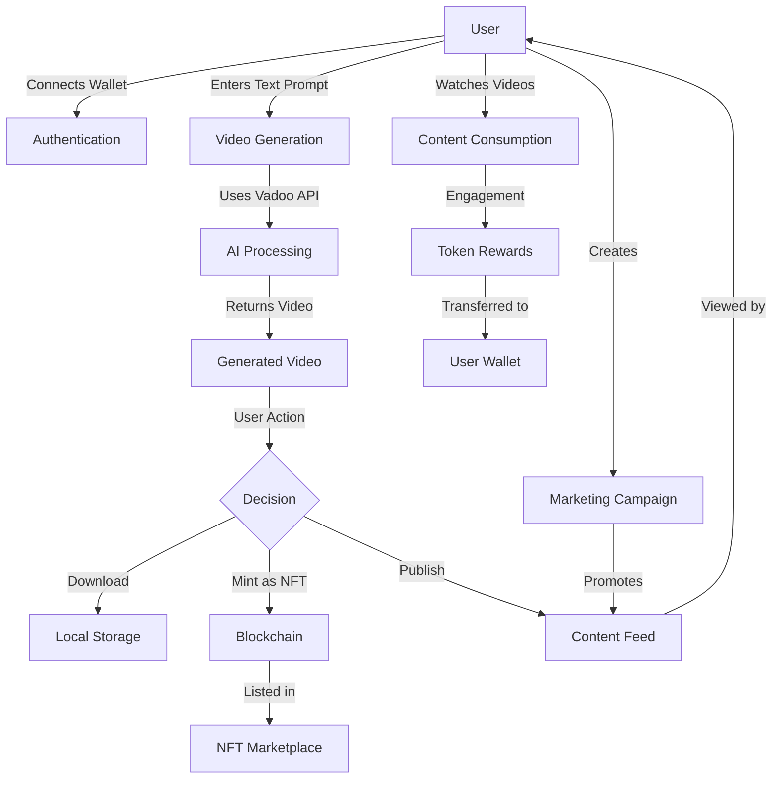

# BlockTok AI

<div align="center">
  
  <h3>AI-Generated Videos on the Injective Blockchain</h3>
</div>

BlockTok AI is an AI-powered short-form video generation platform on the Injective blockchain that revolutionizes user engagement by tokenizing attention. Users earn rewards for watching, sharing, and interacting with AI-generated content, while creators can monetize their content through onchain ad revenue, NFTs, and decentralized marketing campaigns.

## 🚀 Features

- **AI Video Generation**: Create AI-generated short-form videos with customizable options
  - **Text-to-Video**: Generate videos from text descriptions using Vadoo AI
  - **Style Presets**: Apply different artistic styles to generated videos
  - **Video Templates**: Use pre-made templates for quick creation
- **Token Rewards**: Earn INJ tokens for watching, sharing, and interacting with content
- **NFT Marketplace**: Mint videos as NFTs on the Injective blockchain
- **Creator Economy**: Monetize content through various revenue streams
- **Campaign Marketplace**: Create marketing campaigns to promote content
- **Wallet Integration**: Connect your Injective wallet to manage tokens and NFTs

## 🔄 Application Flow



## Technology Stack

- **Frontend**: Next.js 15, React, TypeScript, TailwindCSS
- **Blockchain**: Injective Protocol, Injective SDK
- **AI Integration**:
  - Vadoo AI API for text-to-video generation
  - Custom parameter configuration for high-quality results
- **Authentication**: Wallet-based authentication with Injective
- **Styling**: TailwindCSS with custom components

## AI Video Generation Process

1. **Input**: User provides a text prompt describing the desired video
2. **Processing**: The prompt is sent to Vadoo AI with customized parameters
3. **Generation**: AI generates the video based on the prompt
4. **Delivery**: The completed video is delivered to the user
5. **Actions**: User can download, mint as NFT, or publish to the feed

## 🔒 Environment Setup

To use the video generation feature, you need to set up the following environment variables:

```
NEXT_PUBLIC_VADOO_API_KEY=your_vadoo_api_key_here
NEXT_PUBLIC_APP_URL=http://localhost:3000
```

You can add these to a `.env.local` file in the root of the project.

## Project Architecture

The project follows a modern Next.js architecture with:

- App Router for routing
- Server Components for improved performance
- Server Actions for backend functionality
- Client Components for interactive elements

```
src/
├── app/                 # Next.js app router pages
│   ├── api/             # API routes including Vadoo webhook
│   ├── create/          # Video creation page
│   └── ...              # Other app pages
├── components/          # React components
│   ├── layout/          # Layout components
│   ├── ui/              # UI components
│   ├── video/           # Video-related components
│   └── wallet/          # Wallet integration components
├── contexts/            # React contexts for state management
│   └── WalletContext.tsx # Wallet connection state
├── lib/                 # Utility functions and types
│   ├── mock-data.ts     # Mock data for development
│   ├── textToVideoApi.ts # Vadoo API integration
│   ├── types.ts         # TypeScript type definitions
│   ├── utils.ts         # Utility functions
│   └── wallet.ts        # Wallet integration utilities
└── public/              # Static assets
```

## Key User Flows

1. **Content Creation**:

   - User connects wallet
   - Navigates to Create page
   - Enters text prompt and selects parameters
   - AI generates video
   - User publishes or mints as NFT

2. **Content Consumption**:

   - User browses video feed
   - Watches videos
   - Earns INJ tokens for engagement
   - Tokens are sent to connected wallet

3. **NFT Marketplace**:
   - Creator mints video as NFT
   - NFT is listed in marketplace
   - Buyers purchase with Injective tokens
   - Ownership transfers on blockchain

## 💰 Tokenomics

- **INJ Token**: Native utility token on Injective blockchain
- **Earning Mechanisms**:
  - Watching videos (0.01 INJ per minute)
  - Creating content (0.2 INJ per published video)
  - Community engagement (voting, commenting)
- **Spending Use Cases**:
  - Premium video generation features
  - NFT purchases
  - Campaign creation

## Getting Started

1. Clone the repository:

```bash
git clone https://github.com/yourusername/blocktok-ai.git
cd blocktok-ai
```

2. Install dependencies:

```bash
npm install
```

3. Create a `.env.local` file with your API keys:

```
NEXT_PUBLIC_VADOO_API_KEY=your_vadoo_api_key_here
NEXT_PUBLIC_APP_URL=http://localhost:3000
```

4. Start the development server:

```bash
npm run dev
```

5. Open [http://localhost:3000](http://localhost:3000) in your browser.

## 🔧 Troubleshooting

If you encounter Node.js dependency issues on macOS (e.g., missing libraries like `libicui18n.67.dylib`), you can use our helper script:

```bash
chmod +x run-dev.sh
./run-dev.sh
```

This script will install nvm, set up the correct Node.js version, and run the development server.

## Deployment

The app is optimized for deployment on Vercel, but can be deployed to any platform that supports Next.js applications.

## Future Roadmap

- **Enhanced AI Models**: Integration with more advanced video generation models
- **Real-time Collaboration**: Allow multiple creators to collaborate on videos
- **Advanced Analytics**: Detailed insights for creators about audience engagement
- **Multi-chain Support**: Expand beyond Injective to other EVM-compatible chains
- **Mobile Apps**: Native mobile applications for iOS and Android

## License

This project is licensed under the MIT License - see the LICENSE file for details.

## Contributing

Contributions are welcome! Please feel free to submit a Pull Request.

## Acknowledgements

- [Injective Protocol](https://injective.com/) for blockchain infrastructure
- [Vadoo AI](https://vadoo.ai/) for video generation capabilities
- [Mixkit](https://mixkit.co/) for sample videos used in demonstration
